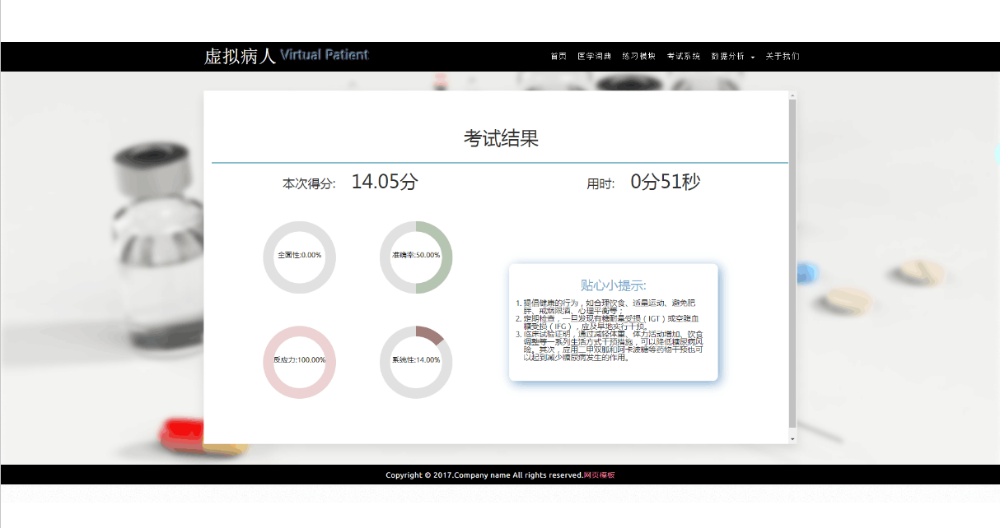

# 基于医学知识图谱的智能化虚拟病人 Virtual-patient 
> 联系邮箱 wangzichaochaochao@gmail.com
Intelligent virtual patient research based on medical knowledge graph

## 项目概述
通过“虚拟病人”进行模拟临床培训是一个新兴且具有巨大发展前景的领域，而医学知识图谱表达和揭示了多源异构、语义多样的医疗大数据中复杂的概念以及概念之间的关联，本项目研究基于知识图谱来建设智能化“虚拟病人”的相关技术与方法，并实现产业化。具体研究内容包括面向临床诊疗过程模拟的医学知识图谱构建与服务方法，针对医学知识多类型、关联复杂的特点，设计医学知识表示模型，对医学实体和实体之间的不确定性关联进行建模；基于该模型，研究大规模医学知识图谱自动构建方法，包括信息抽取、知识融合和知识推理方法，提供医学知识的全局视图；研究医学知识图谱的语义检索和可视化分析方法，实现基于图数据的智能化医学知识服务；最终整合以上研究成果建立交互式可视化知识服务系统，即虚拟病人，以支持临床模拟培训与临床辅助诊断决策。

更多内容见[基于医学知识图谱的智能化虚拟病人PPT](基于医学知识图谱的智能化虚拟病人.pptx) 和 [虚拟病人项目组汇报_190807 PPT](虚拟病人项目组汇报_190807.pptx)

## 系统展示

## 技术路线

## 研究内容框架

